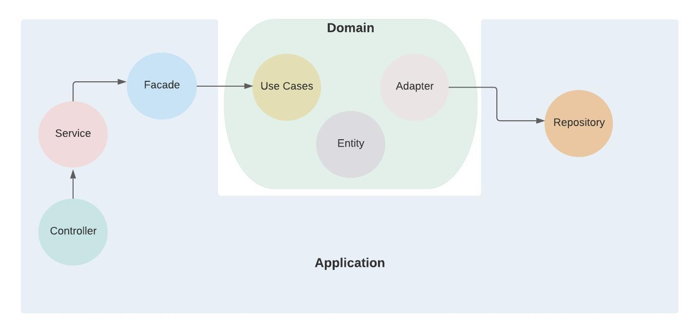
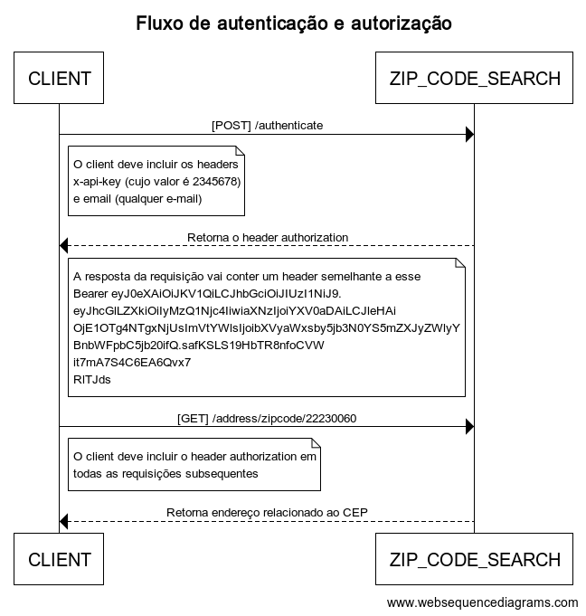

# zip-code-search

### Sumário
- [Introdução](#introdução)
- [Como rodar o projeto?](#como-rodar-o-projeto)
- [Comandos úteis](#comandos-úteis)
- [Por que Java?](#por-que-java)
- [Camadas](#camadas)
- [Arquitetura](#arquitetura)
- [Domínio](#domínio)
- [Autenticação e autorização](#autenticação-e-autorização)
- [Logs](#logs)
- [Endpoints Disponíveis](#endpoints-disponiveis)
- [Requisições HTTP](#requisições-http)

### Introdução
Zip Code Search é um projeto para busca de CEP. O principal intuito do projeto é demonstrar boas práticas de desenvolvimento aplicando técnicas de clean architecture, clean code e padrões GOF.

### Como rodar o projeto?
#### Docker

- É possivel rodar o projeto em containers docker. Execute o comando `make docker-run` para iniciar a aplicação (deve ser executado na raíz do projeto)
    ##### Pré-requisitos
    - [Docker 19.x](https://docs.docker.com/engine/install/)
    - [Docker-compose 1.26.0](https://docs.docker.com/compose/install/)
    
#### Local

- Também é possivel rodar a aplicação diretamente na máquina. Inicie a aplicação com o comando `make local-run` (deve ser executado na raíz do projeto)
	##### Pré-requisitos
	- [Java 11](https://www.oracle.com/java/technologies/javase-jdk11-downloads.html**)

### Comandos úteis
- `make docker-run`: Inicia a aplicação dentro de um container docker
- `make local-run`: Inicia a aplicação diretamente na máquina
- `make clean`: Limpa os artefatos que existentes
- `make install`: Instala as dependências e gera os artefatos .jar
- `make test`: Roda os testes unitários e de integração da aplicação

### Por que Java?
<p>A principal funcionalidade da aplicação é a busca baseada em CEP, onde é usada recursividade para resolver esse desafio. </p>
<p>Java lida melhor com processamentos recursivos e uso intensivo de CPU, se comparado ao Nodejs. Além disso, o sistemas de módulos (Jigsaw), incluído a partir da versão 9 do Java, teve um grande peso na escolha da linguagem, pois o Java permite um melhor encapsulamento do coração da aplicação: a regra de negócio. Por último, a escolha por Java  deu a possibilidade de usar o spring boot, que traz uma série de facilidades como configuração do swagger via código, configuração rápida da camada de dados, configuração simplificada da segurança da API, além de uma série de outras funcionalidades.</p>
	
### Camadas
* **Controller**: Os controladores são responsáveis por expor a API pública da aplicação, neles são feitas validações mais básicas, como por exemplo, se todos os campos obrigatórios estão presentes na requisição.
* **Service**: Nessa camada podem ser incluídas funcionalidades gerais da aplicação que não pertencem às regras de negócio. No projeto, por exemplo, é nessa camada que incluímos a estratégia de cache.
* **Repository**: Camada de persistência dos dados.
* **Use case**: Aqui está o coração da aplicação, todas as regras de negócio devem ser desenvolvidas e isoladas nessa camada.
	
### Arquitetura
<p>A arquitetura da aplicação foi planejada e desenvolvida com base em alguns conceitos de arquitetura limpa, especialmente os princípios de SOLID. O projeto consiste em dois módulos, um deles com as regras de negócio e outro com detalhes (controlador, repositório para de dados, serviço), os módulos foram criados com o Maven, além disso foi usado o Jigsaw no módulo das regras de negócio, com o intuito de garantir um alto nível de encapsulamento, garantindo que vão ser expostos apenas os pacotes estritamente necessários.</p>
	


<p>Como é possivel visualizar na imagem acima, o módulo domínio está bem encapsulado e toda a comunicação com ele é feita através de abstrações. As dependências foram invertidas. Abstrações tendem a variar menos, fazendo com que o domínio esteja menos suscetível a quebrar ou variar por causa de mudanças nos detalhes. A inversão de dependências nesse cenário trouxe alguns benefícios comprovados durante o processo de desenvolvimento, foi possível desenvolver e focar nas regras de negócio sem se preocupar com os detalhes, por exemplo, inicialmente o comportamento dos repositórios foram simulados através de Maps e o processo de desenvolvimento de testes foi facilitado por conta do alto nível de desacoplamento.</p>

### Domínio
O domínio é o coração de qualquer aplicação e por isso merece um tópico específico sobre as estratégias e padrões utilizados.
* **Validador de CEP**: Com o intuito de aplicar o conceito de Open-closed foi usado o padrão strategy para criar os validadores de CEP. Essa estratégia possibilita a adição de novos validadores de maneira simples e sem o risco de quebrar as regras já existentes.
* **Busca de CEP**: Os critérios para busca de CEP funcionam como um conjunto de regras em sequência, que devem ter sua execução interrompida quando necessário. O padrão chain of responsibility se encaixa nessas características e por isso foi escolhido como estratégia para implementação da busca do CEP.
* **Use case**: Contém as regras de negócio da aplicação, eles são a porta de entrada do domínio e são acessíveis apenas via abstrações.
		
### Autenticação e autorização
Para ter acesso às APIs privadas da aplicação o client deve primeiro se autenticar fazendo uma requisição (POST) ao 
endereço http://localhost:8080/api/authenticate, também devem ser incluídos dois headers na requisição: 
o **x-api-key** (identificador necessário para o client ser reconhecido como confiável. Seu valor é 2345678) e o **email** 
(e-mail do responsável pelo client). Após a requisição ser finalizada com sucesso, o zip-code-search vai adicionar 
na resposta o header **authorization**, esse header vai conter um código de autorização que é válido por 60 minutos. O client
deve adicionar esse header em suas requisicões para ter acesso as APIs do zip-code-search.




### Logs
Os logs estão estruturados em formato json e salvos em dois arquivos: um para logs comuns e outro para errors e warning. Segue um exemplo da estrutura:

    {"@timestamp":"2020-08-28T03:54:17.819-03:00","@version":"1","message":"Address Created wit success: ADDRESS AddressDTO(zipCode=23456781, street=Rua David de Oliveira, district=PQ. Lafaiete, city=Duque de Caxias, state=Rio de Janeiro)","logger_name":"com.zipcode.zipcodesearch.address.controller.AddressController","thread_name":"http-nio-8080-exec-2","level":"INFO","level_value":20000}
	
### Endpoints disponiveis
##### OBS: Todos os itens dentro de colchetes devem ser substituídos pelos valores desejados (não esqueça de escapar as strings)
- Autentica o client
    ```
    curl --location --request POST 'http://localhost:8080/api/authenticate'
    --header 'x-api-key: 2345678'
    --header 'email: [EMAIL]'
    ```
- Swagger da aplicação (é aconselhável acessar o endpoint em algum browser, já que seu resultado será uma página HTML)
    ```
    curl --location --request GET 'http://localhost:8080/api/documentation'
    ```
    
- Busca endereço por CEP
    ```
    curl -X GET "http://localhost:8080/api/address/zipcode/[ZIP_CODE]" -H "accept: application/json"
    ```

- Salva novo endereço
    ```    
    curl -X POST "http://localhost:8080/api/address" -H "accept: application/json" -H "Content-Type: application/json" -d "{ \"state\": [STATE], \"city\": [CITY], \"district\": [DISTRICT], \"street\": [STREET], \"zipCode\": [ZIP_CODE]}"
    ```

- Edita endereço existente
    ```
    curl -X PUT "http://localhost:8080/api/address/3" -H "accept: application/json" -H "Content-Type: application/json" -d "{ \"state\": [STATE], \"city\": [CITY], \"district\": [DISTRICT], \"street\": [STREET], \"zipCode\": [ZIP_CODE]}"    
    ```

- Remove endereço
    ```
    curl -X DELETE "http://localhost:8080/api/address/[ADDRESS_ID]" -H "accept: */*"
    ```
  
- Lista todos endereços
    ```
    curl -X GET "http://localhost:8080/api/address" -H "accept: application/json"
    ```
  
- Health check da aplicação
    ```
    curl -X GET "http://localhost:8080/api/analytics/healthCheck" -H "accept: */*"
    ```
  
- Lista todas as métricas suportadas
    ```
    curl -X GET "http://localhost:8080/api/analytics/metric" -H "accept: */*"
    ```
  
- Busca métricas por nome (utilize o endpoint de listagem de métricas para recuperar o nome da métrica desejada e realize a busca nest
e endpoint)
    ```
    curl -X GET "http://localhost:8080/api/analytics/metric/[METRIC_NAME]" -H "accept: */*"
    ```
  
### Requisições HTTP

